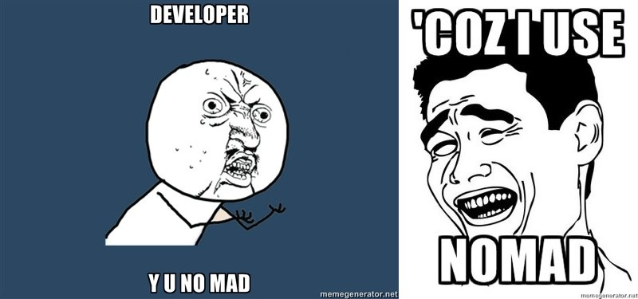

# Database migration
## Pycon Ukraine 2011
## Alexander Solovyov

# Migration versioning

* 1, 2, 3, 4, 5, ...
* Hey, we're using DVCS!

# Tied to a database adapter

* South - Django
* sqlalchemy-migration - SQLAlchemy

# Downgrades

* Almost never tested
* Often not written
* Rarely used

# Nomad

* No downgrades
* Migrations in any language
* Arbitrary versions: 2011-10-23-no-wei
* Dependencies
* Database-agnostic (mostly)

# nomad @ PyPI

